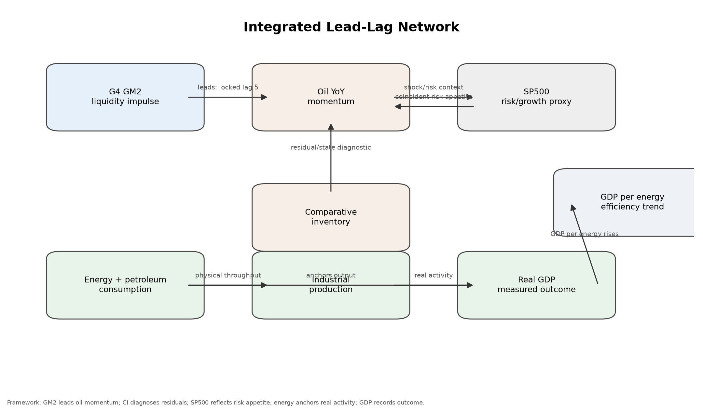

# Energy Model: Oil, Liquidity, Inventory, and the Real Economy

This Canadian-centred project explores how financial conditions, energy markets, physical resource constraints, and economic activity interact over time. Global liquidity and oil benchmarks remain upstream inputs, while existing United States evidence is retained as a comparison dataset.

It began as an oil-market model linking global liquidity to oil-price momentum and is expanding toward broader energy-system modelling. The repository combines a reproducible Python research pipeline with a Node.js educational website that explains the evidence for non-technical readers.

> This is an interpretive research project, not a trading system or investment recommendation.

## Overview

The current model separates the energy-macro system into distinct analytical layers:

```text
Global liquidity
        ↓
Oil price momentum
        ↓
Physical market state
        ↓
Tradable exposure
        ↓
Energy throughput
        ↓
Economic activity
```

The locked oil model uses year-over-year growth in G4 global M2, lagged five months, to describe WTI and Brent price momentum. Comparative inventory, equities, tradable oil exposure, realised crude prices, energy consumption, industrial production, and GDP are analysed as related but conceptually separate layers.

## Canadian Evidence Layer

Canada is now the website's primary domestic geography. The first release publishes 25 core global/Canadian indicators plus Ontario and Alberta context across physical crude balances, consumer energy prices, Canadian-dollar real oil, monetary and financial conditions, monthly GDP by industry, labour utilization, employment structure and household debt service.

The formal scope is **Canadian energy-economic conditions with global oil-market and global-liquidity inputs.** A provisional transparent Canadian classifier now evaluates five supported symptom families, preserves Ontario and Alberta contributions separately, and returns insufficient data for household stress. The existing U.S. classifier remains unchanged as a comparison layer.

See [the Canadian data audit](analysis/canadian_data_audit.md), [indicator catalogue](analysis/canadian_indicator_catalogue.csv), [historical episode library](analysis/canadian_historical_episodes.md), and [processed long-form core](data/processed/canadian_core.csv). Canadian rules are versioned in `config/canada_symptom_rules.yaml` and `config/canada_regime_rules.yaml`.

## Research Framework

1. **Liquidity impulse:** G4 GM2 is tested as a leading financial signal for oil-price momentum.
2. **Physical oil-market state:** Comparative inventory helps diagnose whether oil is rich or cheap relative to the liquidity-implied path.
3. **Market pricing:** WTI and Brent are benchmarks, USO represents investor-accessible exposure, and the S&P 500 provides risk and growth context.
4. **Physical economy:** Energy and petroleum consumption anchor real activity, while industrial production and real GDP record economic outcomes at different frequencies.
5. **Efficiency and structural change:** GDP per unit of energy tracks how much measured output is produced from physical energy throughput.

The project prioritizes interpretable specifications, chronological validation, explicit lag conventions, HAC/Newey-West standard errors, shock-period checks, and reproducible source caching.

## Food And Housing Affordability

The affordability layer keeps four concepts separate: international food commodity prices, domestic consumer food prices, residential property purchase prices, and current shelter costs. FAO food indices describe international commodity quotations rather than grocery bills. Statistics Canada and BLS food CPIs describe domestic consumer baskets. Statistics Canada NHPI, FHFA, and BIS series describe property purchase prices, while rent, mortgage-interest cost, replacement cost, and shelter CPI describe distinct current housing-service costs.

Interactive pages at `/affordability/food` and `/affordability/housing` compare these histories across global, Canadian, Ontario, and U.S. evidence. Canadian purchasing-power denominators now include quarterly disposable income per person, CPI-deflated real income per person, the household saving rate, monthly Canada and Ontario wages, and separate food, rent, shelter, mortgage-interest, and house-price comparisons with income or wages. Quarterly income is never forward-filled into monthly observations. The new metadata identifies candidate future symptoms but does not alter either live classifier.

## System-Response Diagnostic Framework

The first diagnostic release extends the project from oil-price interpretation into a five-layer system-response framework:

1. **Physical energy conditions:** production, consumption, inventories, comparative inventory, and refinery constraints.
2. **Energy affordability and financial conditions:** real oil, household and GDP energy burden, energy inflation, income, rates, credit, and GM2.
3. **Production, consumption, and investment response:** industry, manufacturing, spending, investment, GDP, and productivity.
4. **Labour and household consequences:** hours, temporary work, employment structure, real wages, sentiment, and delinquency.
5. **Social and institutional symptoms:** documented as proposed research only; no social-instability model or unified stress score is implemented.

The compact dataset, indicator metadata, benchmark tests, and historical schema are generated in [system_response_core.csv](data/processed/system_response_core.csv), [system_response_indicator_catalogue.csv](analysis/system_response_indicator_catalogue.csv), [system_response_framework.md](analysis/system_response_framework.md), and [historical_episode_library.md](analysis/historical_episode_library.md).

The first-pass energy-burden test does not show stable material out-of-sample improvement over the autoregressive benchmark. Physical tightness and labour measures therefore retain evidence labels such as **contextual indicator**, **supported historical pattern**, or **experimental proxy** unless a relationship has passed the project’s validation rules. The locked GM2-only lag-5 oil model remains unchanged.

## Current Validated Findings

- The strongest simple G4 GM2 correlation with WTI and Brent YoY occurs at a four-month lead: `0.532` for WTI and `0.523` for Brent.
- Rolling validation supports a nearby five-to-six-month lead range. The final benchmark oil model is locked at **GM2-only lag 5**.
- The locked 60-month rolling validation RMSE is `31.628` for WTI YoY and `32.358` for Brent YoY.
- Comparative inventory does not improve the primary rolling RMSE or MAE by the project's five-percent decision rule. Its validated role is a residual, state, and regime diagnostic.
- Inventory and regime variables explain approximately `14.8%` of WTI and `13.5%` of Brent residual variance around the GM2-implied path.
- S&P 500 monthly returns are primarily contemporaneous with oil returns. Stocks add growth and risk context but do not improve the locked oil model by the five-percent rule.
- U.S. energy consumption growth and real GDP growth have a contemporaneous quarterly correlation of `0.680`; petroleum consumption growth and real GDP growth correlate at `0.738`.
- GDP per unit of energy rises over time, consistent with efficiency gains and structural change while economic activity remains physically grounded in energy throughput.

See [the executive summary](analysis/executive_summary.md), [model card](analysis/model_card.md), and [integrated lead-lag atlas](analysis/integrated_lead_lag_atlas.md) for the complete interpretation.



## System Architecture

```text
energy-model/
├── oil_model/              # Python research pipeline
├── website/                # Vite/React educational website
├── analysis/               # generated research findings and tables
├── charts/                 # generated research charts
├── data/                   # cached sources, seeds, and processed datasets
├── docs/                   # research and deployment documentation
├── scripts/                # release verification entry points
├── tests/                  # pipeline and reproducibility tests
├── README.md
├── LICENSE
├── CITATION.cff
├── CONTRIBUTING.md
└── pyproject.toml
```

The Python pipeline owns data acquisition, transformations, models, validation, written findings, chart generation, and website data contracts. The website is an interactive research-observatory layer: it loads generated histories and metadata but does not run, refit, or alter the research model.

Data-dependent website interpretation is refinery-driven. Route-level summaries resolve through `website/public/generated/presentation-manifest.json`, generated from classifier and indicator outputs plus `config/presentation_rules.json`. React renders this contract and does not choose evidence status or compose current analytical conclusions. See [docs/refinery_architecture.md](docs/refinery_architecture.md).

## Website

The educational website uses Node.js, TypeScript, Vite, React, Tailwind CSS, Recharts, and React Router. It presents Canadian conditions as the domestic default, with Ontario regional context, global inputs and a separate United States comparison.

Its system-response sections provide current readings by layer, live symptom evaluation, transparent regime candidates, a searchable indicator catalogue, historical episode comparison, energy-burden and labour diagnostics, and an explicit implemented/experimental/proposed roadmap. The formal classification scope is United States energy-economic conditions with global oil-market and global-liquidity inputs. Separate provisional monthly and confirmed quarterly clocks preserve coverage, freshness, source-date, and revised-data warnings; mixed and unclassified outcomes remain available. Rules live in `config/symptom_rules.json` and `config/regime_rules.json`, not in React components.

The oil, liquidity, inventory, USO, equities, energy/GDP, system-response, Current State, and economic-output-quality pages use lazy-loaded interactive research charts backed by Python-generated JSON. Readers can inspect exact observations, select valid transformations and time ranges, compare historical episodes, explore lag conventions, download data, and open unchanged publication PNGs. Current readings include historical sparklines, percentiles, normal ranges, momentum, source dates, and full-history modal charts. Current State and the main diagnostic pages begin with generated evidence matrices that distinguish supporting, mixed, contradicting, and insufficient evidence before presenting detailed charts. Every chart includes a permanent plain-language summary and an expandable calculation, interpretation, limitation, source, and observation-date disclosure. Raw incompatible units are kept in synchronized panels rather than forced onto a misleading shared axis. The chart schema and extension workflow are documented in [docs/website_chart_data.md](docs/website_chart_data.md), and the route-by-route conversion record is in [analysis/website_visual_audit.md](analysis/website_visual_audit.md).

## Economic Output Quality

The `/output-quality` research module compares four separate lenses: headline measured output, net productive capacity, realized household prosperity, and financialization or asset valuation. It uses official real net domestic product rather than manually subtracting non-additive chained-dollar components. Finance, insurance, and real estate remain separate series and are not treated as intrinsically valueless.

An experimental household-command measure subtracts inflation-adjusted BLS Consumer Expenditure Survey shelter, food, and utilities/fuels/public-services costs from Census real median household income. All components are published beside the result, and no composite prosperity or financialization score is introduced. See [analysis/economic_output_quality.md](analysis/economic_output_quality.md).

```bash
cd website
npm install
npm run dev
```

Create a production build with `npm run build`. See [website/README.md](website/README.md) for local development and [docs/deployment.md](docs/deployment.md) for GitHub Pages and custom-domain deployment.

## Data Sources

Primary public sources include:

- **Statistics Canada:** Canadian and Ontario CPI, labour-force rates, monthly real GDP by industry, crude production/trade/refinery/inventory balances, electricity generation, and household debt service.
- **Statistics Canada household accounts and labour tables:** quarterly household disposable income, consumption, saving, and population; monthly Canada and Ontario hourly wages and weekly earnings.
- **Food and Agriculture Organization:** monthly nominal and real international Food Price Indices and commodity components.
- **Bank for International Settlements:** quarterly selected nominal and real residential-property price statistics and documented country-group aggregates.
- **Federal Housing Finance Agency:** U.S. monthly purchase-only House Price Index, distributed through FRED.
- **Bank of Canada:** policy rate, CAD/USD exchange rate, and Canadian M2++ through the official Valet API.
- **Canada Energy Regulator:** documented public commodity-data adapter and physical-market source audit; some confidential or unstable series remain proposed.

- **Federal Reserve Economic Data (FRED):** U.S. M2, WTI, Brent, exchange rates, CPI, S&P 500, U.S. real GDP, and industrial production.
- **Bureau of Economic Analysis and Bureau of Labor Statistics via FRED:** energy expenditures, disposable income, spending, investment, productivity, hours, wages, employment structure, and energy CPI.
- **European Central Bank:** euro-area M2.
- **Bank of Japan:** Japan M2.
- **People's Bank of China-sourced public data and IMF/FRED history:** China M2.
- **U.S. Energy Information Administration:** crude inventories, total and petroleum energy consumption, refiner acquisition costs, first purchase prices, and imported crude costs.
- **Yahoo Finance-compatible public chart data:** USO adjusted close.

Raw source responses are cached under `data/raw/` for auditability. Detailed series identifiers, units, transformations, and formulas are documented in [analysis/model_card.md](analysis/model_card.md) and [analysis/latest_source_values.md](analysis/latest_source_values.md).

## Reproducibility

Python 3.10 or newer is required. From the repository root:

```bash
python -m venv .venv
.venv/bin/python -m pip install -e '.[dev,parquet]'
.venv/bin/python -m pytest -q
.venv/bin/python -m oil_model.pipeline --root .
.venv/bin/python -m oil_model.verify_release --root .
```

The complete release workflow is also available through:

```bash
make PYTHON=.venv/bin/python release
```

Build the website after the research artifacts exist:

```bash
cd website
npm install
npm run build
```

The pipeline can use the committed raw-data cache. Use `--refresh` only when intentionally retrieving current source data and regenerating the research release.

## Limitations

- The G4 M2 aggregate is a USD-converted liquidity proxy, not a harmonized global monetary statistic.
- Same-month foreign-exchange conversion mixes domestic money growth with currency movements.
- U.S. comparative inventory does not represent the full global physical oil balance.
- Monthly averages can conceal intra-month market disruptions.
- Linear models can miss nonlinear policy, geopolitical, production, refining, shipping, and futures-curve effects.
- YoY variables overlap and are autocorrelated; their lead-lag relationships are more useful for macro-cycle interpretation than precise market timing.
- Historical correlations and rolling forecasts are descriptive and do not establish causality.
- Shock regimes such as 2008-2009, 2014-2017, 2020-2021, and 2022-2023 can behave differently from normal periods.
- Household energy burden is an aggregate proxy and does not reveal distributional exposure.
- Quarterly macro and credit observations are latest-vintage and are not suitable for strict real-time claims without vintage data.
- The household-command experiment combines median income with average consumer-unit expenditures and is not an official disposable-income measure.
- A consistent global spare-capacity history and redistributable continuous futures curve are not yet implemented.

## Future Research Directions

This repository is intended to grow from an oil-market model into a broader energy-system research framework. Future modules may explore:

- energy supply adequacy
- energy surplus and EROI
- inflation transmission
- richer employment-quality validation
- real-time economic stress diagnostics
- social-system responses

These modules are research directions only and are **not currently implemented**.

## License and Citation

The code is released under the [MIT License](LICENSE). Please use [CITATION.cff](CITATION.cff) when citing the software or research framework. Contributions are welcome under the standards in [CONTRIBUTING.md](CONTRIBUTING.md).
